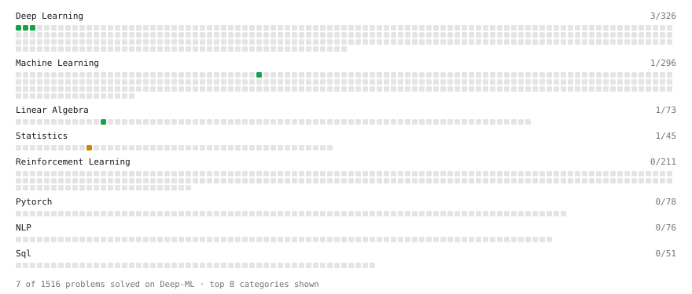

# Deep-ML

My machine learning practice from [Deep-ML](https://www.deep-ml.com). Every solution here was written by hand.

**4** solved · 4 problems · 0 labs · 0 math

[**Browse the interactive portfolio**](https://mobinaamrollahi.github.io/deep-ml/) to replay this filling in over time.

## Problems

| | Difficulty | Solved | |
| --- | --- | --- | --- |
| [Binary Classification with Logistic Regression](https://www.deep-ml.com/problems/104) | easy | 2026-10-07 | [solution](problems/0104-binary-classification-with-logistic-regression) |
| [Sigmoid Activation Function Understanding](https://www.deep-ml.com/problems/22) | easy | 2026-10-07 | [solution](problems/0022-sigmoid-activation-function-understanding) |
| [Maximum Likelihood Estimation for Gaussian Distribution](https://www.deep-ml.com/problems/337) | medium | 2026-10-06 | [solution](problems/0337-maximum-likelihood-estimation-for-gaussian-distribution) |
| [Newton's Method for Optimization](https://www.deep-ml.com/problems/221) | medium | 2026-10-06 | [solution](problems/0221-newton-s-method-for-optimization) |

---

_This file is regenerated by Deep-ML on every push._
